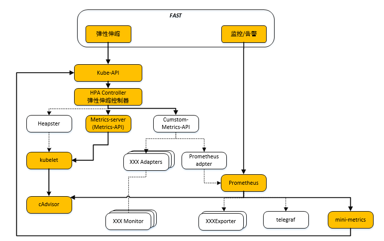

# mini-metrics

# Architecture


# Usage
```
Usage of ./mini-metrics:
  -alsologtostderr
    	log to standard error as well as files
  -interval duration
    	How long collector interval. (default 3s)
  -log_backtrace_at value
    	when logging hits line file:N, emit a stack trace
  -log_dir string
    	If non-empty, write log files in this directory
  -logtostderr
    	log to standard error instead of files
  -metrics-path string
    	metrcis url path. (default "/metrics")
  -namespace string
    	namespace to be enabled for monitoring
  -port string
    	metrics listen port. (default "9090")
  -stderrthreshold value
    	logs at or above this threshold go to stderr
  -v value
    	log level for V logs
  -vmodule value
    	comma-separated list of pattern=N settings for file-filtered logging

env:
export KUBERNETES_SERVICE_PORT=443
export KUBERNETES_SERVICE_HOST=172.16.74.176
ls -al /var/run/secrets/kubernetes.io/serviceaccount/

run cmd:
./mini-metrics -v 3 -alsologtostderr -port 8080
```

# How to build
```
git clone git@github.com:sak0/mini-metrics.git

yum install glibc-static

CGO_ENABLED=1 GOOS=linux go build -a -ldflags '-extldflags "-static"'
docker build .
```
